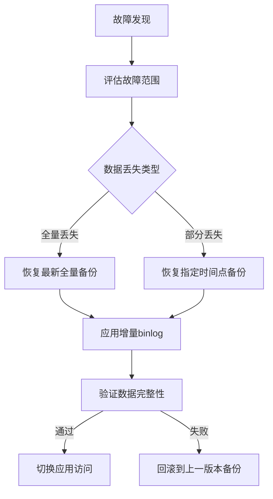

# 新闻资讯发布与推荐系统 数据库设计文档

**版本**：V1.0.1

**适用系统版本**：V1.0.0

**一致性声明**：本文档严格对齐《软件需求规格说明书（SRS）》与《系统架构设计文档》，核心实体、业务规则、非功能需求完全匹配，无偏离、无新增、无遗漏；优化后增强了性能设计、可扩展性与运维友好性。

------

## 1 概述

### 1.1 目标与范围

- **设计目标**：为新闻资讯发布与推荐系统提供**标准化、高性能、高安全、易扩展**的 MySQL 8.0 数据库存储方案，支撑用户管理、新闻 CMS、评论互动、内容推荐、缓存统计等核心业务场景的数据持久化与高效访问；兼顾数据一致性、可维护性与未来业务扩展需求。

- 设计范围

  - 覆盖系统**12 张核心业务表**的逻辑与物理设计（用户、角色、分类、标签、新闻、评论、点赞、统计、浏览记录、操作日志、系统配置、新闻 - 标签关联）。
  - 包含表结构、索引、约束、数据初始化、备份恢复、性能优化、运维规范等全维度设计。
  - **不涉及**：Redis 缓存设计（由系统架构文档单独定义）、非本版本需求的智能推荐 / 多租户等扩展数据结构。
  

### 1.2 命名规范

| 类型     | 规则                                                         | 示例                                                     |
| -------- | ------------------------------------------------------------ | -------------------------------------------------------- |
| 表名     | 小写 + 下划线，业务前缀区分：`t_`（通用表）、`t_news_`（新闻业务表）、`t_sys_`（系统表）；核心表名简化，增强可读性 | `t_user`、`t_news`（替代`t_news_info`）                  |
| 字段名   | 小写 + 下划线，语义明确；主键统一为`id`（BIGINT 自增）；公共字段标准化：`created_at`/`updated_at`/`is_deleted` | `publish_time`、`shelf_status`                           |
| 索引名   | 普通索引：`idx_表名_字段名1_字段名2`；唯一索引：`uk_表名_字段名`；主键索引：`pk_表名` | `idx_t_news_category_status`、`uk_t_user_username`       |
| 外键名   | `fk_子表名_父表名_关联字段`，简化冗余前缀                    | `fk_t_news_category_id`（替代`fk_t_news_info_category`） |
| 分区表名 | 按时间分区表：`原表名_yyyyMM`（预留规则）                    | `t_news_comment_202603`                                  |

### 1.3 技术约束

- 字符集：`utf8mb4`（支持 emoji），排序规则：`utf8mb4_general_ci`（兼顾性能与兼容性）

- 存储引擎：`InnoDB`（支持事务、外键、行级锁、MVCC），禁用 MyISAM

- 时间字段：

  - 业务时间（如`publish_time`）：`DATETIME`（无时区依赖，范围更广）
  - 系统时间（如`created_at`）：`TIMESTAMP`（自动更新，节省空间）

- 字段类型：

  - 主键 / 关联 ID：`BIGINT UNSIGNED`（无符号，扩大取值范围，避免负数）
  - 状态字段：`TINYINT UNSIGNED`（0-255，满足枚举需求，节省空间）
  - 计数字段：`INT UNSIGNED`（阅读量 / 点赞数等，非负）

- 事务隔离级别：`READ COMMITTED`（避免幻读，兼顾性能）

------

## 2 逻辑设计

### 2.1 核心实体与关系（E-R）

| 实体                     | 关系                        | 说明                                                         |
| ------------------------ | --------------------------- | ------------------------------------------------------------ |
| 用户（t_user）           | ↔ 角色（t_role）            | 多对一：一个用户属于一个角色，一个角色对应多个用户；角色预设（USER/ADMIN） |
| 新闻（t_news）           | ↔ 分类（t_news_category）   | 多对一：一篇新闻属于一个分类，分类禁用则新闻不可前台展示     |
| 新闻（t_news）           | ↔ 标签（t_news_tag）        | 多对多：通过中间表`t_news_tag_rel`实现，单篇新闻最多关联 5 个标签 |
| 新闻（t_news）           | ↔ 评论（t_news_comment）    | 一对多：一篇新闻有多个评论，评论需审核通过且未隐藏才展示     |
| 用户（t_user）           | ↔ 新闻（t_news）            | 多对多：通过点赞表`t_news_like`、浏览记录表`t_user_browse`实现 |
| 新闻（t_news）           | ↔ 统计（t_news_statistics） | 一对一：一篇新闻对应一条统计记录，Redis 定时同步计数数据     |
| 系统配置（t_sys_config） | 无关联                      | 键值对存储，独立管理系统运行参数                             |

### 2.2 实体清单

| 表名                | 中文名称          | 核心业务场景                   | 优化点                                  |
| ------------------- | ----------------- | ------------------------------ | --------------------------------------- |
| t_user              | 用户表            | 用户注册、登录、权限管理       | 字段类型优化为 UNSIGNED，补充索引       |
| t_role              | 角色表            | 角色定义、权限关联             | 仅保留核心字段，预设数据固化            |
| t_news_category     | 新闻分类表        | 新闻分类管理、筛选             | 增加`parent_id`（预留多级分类）         |
| t_news_tag          | 新闻标签表        | 新闻标签管理、检索             | 简化冗余字段                            |
| t_news_tag_rel      | 新闻 - 标签关联表 | 实现新闻与标签的多对多关系     | 增加联合唯一索引，避免重复关联          |
| t_news              | 新闻主表          | 新闻内容发布、编辑、上下架管理 | 表名简化（原`t_news_info`），字段精简   |
| t_news_comment      | 新闻评论表        | 用户评论发布、审核、展示管理   | 预留按时间分区字段，优化索引            |
| t_news_like         | 新闻点赞表        | 用户点赞 / 取消点赞记录        | 唯一索引强化，避免重复点赞              |
| t_news_statistics   | 新闻统计量表      | 新闻阅读量、点赞数持久化存储   | 增加`sync_version`（数据同步版本号）    |
| t_user_browse       | 用户浏览记录表    | 登录用户新闻浏览行为记录       | 增加`browse_duration`（浏览时长）       |
| t_sys_operation_log | 操作日志表        | 系统操作审计、登录日志记录     | 按时间分区设计，优化检索性能            |
| t_sys_config        | 系统配置表        | 系统运行参数配置管理           | 增加`config_type`（配置类型），便于归类 |

------

## 3 物理设计

### 3.1 表结构清单

| 表名                | 中文名称     | 核心优化点                                                   |
| ------------------- | ------------ | ------------------------------------------------------------ |
| t_user              | 用户表       | 密码字段命名规范（`password_hash`），增加`last_login_ip`，索引优化 |
| t_news              | 新闻主表     | 表名简化，`content`字段改为`MEDIUMTEXT`（平衡存储与性能），增加`version`（乐观锁） |
| t_news_comment      | 新闻评论表   | 增加`reviewer_id`（审核人 ID）、`review_time`（审核时间），预留分区字段 |
| t_news_statistics   | 新闻统计量表 | 增加`sync_time`（最后同步时间）、`sync_version`（避免并发同步冲突） |
| t_sys_operation_log | 操作日志表   | 按`created_at`分区，增加`operation_result`（操作结果：成功 / 失败） |

### 3.2 核心表字段定义

#### 3.2.1 用户表（t_user）

| 字段名        | 数据类型         | 长度 | 是否为空 | 默认值                      | 字段说明                    | 优化点                 |
| ------------- | ---------------- | ---- | -------- | --------------------------- | --------------------------- | ---------------------- |
| id            | BIGINT UNSIGNED  | 20   | NOT NULL | AUTO_INCREMENT              | 主键 ID                     | 无符号，避免负数       |
| username      | VARCHAR          | 50   | NOT NULL | -                           | 用户名（4-20 位）           | 唯一索引，字符长度精准 |
| password_hash | VARCHAR          | 255  | NOT NULL | -                           | 密码哈希值（BCrypt 加密）   | 命名规范，明确加密方式 |
| nickname      | VARCHAR          | 30   | NULL     | username                    | 用户昵称                    | 默认值优化，减少空值   |
| role_id       | BIGINT UNSIGNED  | 20   | NOT NULL | 1                           | 角色 ID（关联 t_role.id）   | 无符号，默认普通用户   |
| status        | TINYINT UNSIGNED | 1    | NOT NULL | 1                           | 状态（1 正常 / 0 禁用）     | 无符号枚举             |
| is_deleted    | TINYINT UNSIGNED | 1    | NOT NULL | 0                           | 逻辑删除（0 未删 / 1 已删） | 无符号                 |
| created_at    | TIMESTAMP        | -    | NOT NULL | CURRENT_TIMESTAMP           | 创建时间                    | 自动生成               |
| updated_at    | TIMESTAMP        | -    | NULL     | ON UPDATE CURRENT_TIMESTAMP | 更新时间                    | 自动更新               |
| last_login_at | DATETIME         | -    | NULL     | -                           | 最后登录时间                | DATETIME 无时区依赖    |
| last_login_ip | VARCHAR          | 50   | NULL     | -                           | 最后登录 IP                 | 新增，强化审计         |

#### 3.2.2 新闻主表

| 字段名          | 数据类型         | 长度 | 是否为空 | 默认值                      | 字段说明                           | 优化点                  |
| --------------- | ---------------- | ---- | -------- | --------------------------- | ---------------------------------- | ----------------------- |
| id              | BIGINT UNSIGNED  | 20   | NOT NULL | AUTO_INCREMENT              | 主键 ID                            | 无符号                  |
| title           | VARCHAR          | 50   | NOT NULL | -                           | 新闻标题                           | 唯一索引，长度精准      |
| category_id     | BIGINT UNSIGNED  | 20   | NOT NULL | -                           | 分类 ID（关联 t_news_category.id） | 外键优化                |
| cover_url       | VARCHAR          | 255  | NULL     | -                           | 封面图片 URL                       | 增加格式校验（应用层）  |
| content         | MEDIUMTEXT       | -    | NOT NULL | -                           | 新闻正文（富文本）                 | 替代 LONGTEXT，节省空间 |
| publish_status  | TINYINT UNSIGNED | 1    | NOT NULL | 0                           | 发布状态（0 草稿 / 1 发布）        | 无符号枚举              |
| shelf_status    | TINYINT UNSIGNED | 1    | NOT NULL | 1                           | 上下架状态（1 上架 / 0 下架）      | 无符号枚举              |
| publish_user_id | BIGINT UNSIGNED  | 20   | NOT NULL | -                           | 发布人 ID（关联 t_user.id）        | 外键优化                |
| publish_time    | DATETIME         | -    | NULL     | -                           | 正式发布时间                       | DATETIME 适配业务时间   |
| version         | INT UNSIGNED     | 11   | NOT NULL | 1                           | 乐观锁版本号                       | 新增，避免并发编辑冲突  |
| is_deleted      | TINYINT UNSIGNED | 1    | NOT NULL | 0                           | 逻辑删除                           | 无符号                  |
| created_at      | TIMESTAMP        | -    | NOT NULL | CURRENT_TIMESTAMP           | 创建时间                           | 自动生成                |
| updated_at      | TIMESTAMP        | -    | NULL     | ON UPDATE CURRENT_TIMESTAMP | 更新时间                           | 自动更新                |

### 3.3 索引设计

| 索引类型 | 索引名                        | 表名                | 索引字段                                  | 优化作用                                  |
| -------- | ----------------------------- | ------------------- | ----------------------------------------- | ----------------------------------------- |
| 唯一索引 | uk_t_user_username            | t_user              | username                                  | 保证用户名全局唯一                        |
| 普通索引 | idx_t_user_role_status        | t_user              | role_id, status                           | 加速按角色 + 状态查询用户（如管理员列表） |
| 唯一索引 | uk_t_news_title               | t_news              | title                                     | 保证新闻标题全局唯一                      |
| 复合索引 | idx_t_news_category_shelf     | t_news              | category_id, shelf_status, publish_status | 加速前台分类筛选已上架新闻                |
| 复合索引 | idx_t_news_comment_news_audit | t_news_comment      | news_id, audit_status, is_hidden          | 加速按新闻查询可展示评论                  |
| 唯一索引 | uk_t_news_like_user_news      | t_news_like         | user_id, news_id                          | 强制单用户对单新闻仅一条点赞记录          |
| 分区索引 | idx_t_sys_operation_log_time  | t_sys_operation_log | created_at                                | 按时间分区检索，提升日志查询性能          |

### 3.4 外键与约束设计

| 外键名                     | 子表           | 子表字段     | 父表                | 父表字段                 | 级联规则                             | 优化点                 |
| -------------------------- | -------------- | ------------ | ------------------- | ------------------------ | ------------------------------------ | ---------------------- |
| fk_t_user_role_id          | t_user         | role_id      | t_role              | id                       | ON DELETE RESTRICT ON UPDATE CASCADE | 限制删除，级联更新     |
| fk_t_news_category_id      | t_news         | category_id  | t_news_category     | id                       | ON DELETE RESTRICT ON UPDATE CASCADE | 简化外键名             |
| fk_t_news_comment_news     | t_news_comment | news_id      | t_news              | id                       | ON DELETE CASCADE ON UPDATE CASCADE  | 级联删除，避免孤立数据 |
| 约束名                     | 表名           | 约束字段     | 约束规则            | 优化点                   |                                      |                        |
| chk_t_news_publish_time    | t_news         | publish_time | 发布状态为 1 时非空 | 业务约束，避免数据不一致 |                                      |                        |
| chk_t_news_comment_content | t_news_comment | content      | 长度 1-500 字符     | 应用层 + 数据库双层校验  |                                      |                        |

### 3.5 分区设计

| 表名                | 分区类型          | 分区字段    | 分区规则                                               | 适用场景                   |
| ------------------- | ----------------- | ----------- | ------------------------------------------------------ | -------------------------- |
| t_news_comment      | 范围分区（RANGE） | created_at  | 按月份分区：`PARTITION BY RANGE (TO_DAYS(created_at))` | 评论数据量年增长 50 万条   |
| t_user_browse       | 范围分区（RANGE） | browse_time | 按月份分区，保留最近 6 个月数据在主表                  | 浏览记录高频写入，低频查询 |
| t_sys_operation_log | 范围分区（RANGE） | created_at  | 按季度分区，归档超过 1 年的数据                        | 日志数据量年增长 100 万条  |

### 3.6 视图与存储过程

#### 3.6.1 常用视图（简化业务查询）

```
-- 可展示新闻视图（已发布+已上架+未删除）
CREATE VIEW v_news_available AS
SELECT n.id, n.title, n.category_id, c.category_name, n.cover_url, 
       n.publish_time, s.read_count, s.like_count
FROM t_news n
LEFT JOIN t_news_category c ON n.category_id = c.id
LEFT JOIN t_news_statistics s ON n.id = s.news_id
WHERE n.publish_status = 1 
  AND n.shelf_status = 1 
  AND n.is_deleted = 0
  AND c.status = 1;

-- 用户评论审核视图
CREATE VIEW v_news_comment_pending AS
SELECT c.id, c.news_id, n.title, c.user_id, u.nickname, c.content, c.created_at
FROM t_news_comment c
LEFT JOIN t_news n ON c.news_id = n.id
LEFT JOIN t_user u ON c.user_id = u.id
WHERE c.audit_status = 0 AND c.is_deleted = 0;
```

#### 3.6.2 存储过程（批量操作 + 数据同步）

```
-- 批量同步Redis计数到MySQL
DELIMITER //
CREATE PROCEDURE sync_news_statistics()
BEGIN
    -- 开启事务
    START TRANSACTION;
    -- 更新阅读量
    UPDATE t_news_statistics s
    JOIN (
        SELECT news_id, CAST(value AS UNSIGNED) AS read_count 
        FROM redis_sync_temp 
        WHERE type = 'view'
    ) r ON s.news_id = r.news_id
    SET s.read_count = r.read_count, s.sync_time = NOW(), s.sync_version = s.sync_version + 1;
    
    -- 更新点赞数
    UPDATE t_news_statistics s
    JOIN (
        SELECT news_id, CAST(value AS UNSIGNED) AS like_count 
        FROM redis_sync_temp 
        WHERE type = 'like'
    ) l ON s.news_id = l.news_id
    SET s.like_count = l.like_count, s.sync_time = NOW(), s.sync_version = s.sync_version + 1;
    
    -- 提交事务
    COMMIT;
END //
DELIMITER ;
```

------

## 4 非功能性设计

### 4.1 容量与性能

#### 4.1.1 容量预估

| 表名                | 初始数据量 | 单条大小 | 初始存储 | 年增长量 | 年增长存储 | 3 年总存储 | 优化策略                        |
| ------------------- | ---------- | -------- | -------- | -------- | ---------- | ---------- | ------------------------------- |
| t_user              | 1 万条     | 1KB      | 10MB     | 5 万条   | 50MB       | 160MB      | 索引优化，无冗余字段            |
| t_news              | 1 千条     | 50KB     | 50MB     | 1 万条   | 500MB      | 1.55GB     | 正文用 MEDIUMTEXT，缓存热点数据 |
| t_news_comment      | 5 万条     | 2KB      | 100MB    | 50 万条  | 1GB        | 3.1GB      | 按时间分区，归档历史数据        |
| t_news_statistics   | 1 千条     | 100B     | 100KB    | 1 万条   | 1MB        | 3.1MB      | 合并更新，减少写入次数          |
| t_sys_operation_log | 10 万条    | 1KB      | 100MB    | 100 万条 | 1GB        | 3.1GB      | 分区存储，日志压缩              |

#### 4.1.2 性能优化策略

| 优化维度       | 具体措施                                                     |
| -------------- | ------------------------------------------------------------ |
| 索引优化       | 1. 核心查询字段建立复合索引（如`category_id + shelf_status`）2. 避免冗余索引（如单独的`category_id`索引）3. 禁止在大文本字段建索引 |
| 查询优化       | 1. 禁用`SELECT *`，仅查询必要字段2. 分页查询使用`LIMIT + 索引排序`，避免`OFFSET`深分页3. 热点查询优先走 Redis 缓存 |
| 写入优化       | 1. 批量写入替代单次写入（如评论批量审核）2. 延迟更新非核心字段（如统计数定时同步）3. 使用乐观锁避免长事务 |
| 数据库配置优化 | 1. `innodb_buffer_pool_size`：设置为物理内存的 50%-70%2. `innodb_flush_log_at_trx_commit`：生产环境设为 2（兼顾性能与安全）3. `query_cache_type`：禁用（8.0 已废弃） |

### 4.2 安全与权限

#### 4.2.1 数据安全

| 安全维度     | 具体措施                                                     |
| ------------ | ------------------------------------------------------------ |
| 敏感数据保护 | 1. 密码：BCrypt 加盐加密（工作因子 10），禁止可逆加密2. 手机号 / IP：脱敏存储（如 138****1234）3. 备份数据加密存储 |
| 操作安全     | 1. 所有 DML 操作记录审计日志2. 高危操作（删除 / 下架）需二次确认3. 防止 SQL 注入（预编译 + 参数校验） |
| 传输安全     | 1. 应用与数据库间启用 SSL 加密2. 禁止公网直连数据库，仅内网访问3. 数据库端口非默认（如 3307） |

#### 4.2.2 权限控制

| 账号类型                    | 权限范围                                                     | 适用场景                 |
| --------------------------- | ------------------------------------------------------------ | ------------------------ |
| 超级管理员（root）          | 仅运维人员使用，本地访问，拥有全部权限                       | 数据库部署、紧急故障处理 |
| 应用读写账号（news_app_rw） | 仅授予`SELECT/INSERT/UPDATE/DELETE`权限，禁止 DDL 操作，绑定应用服务器 IP | 业务应用正常运行         |
| 应用只读账号（news_app_ro） | 仅授予`SELECT`权限，绑定报表 / 监控服务器 IP                 | 数据统计、监控查询       |
| 审计账号（news_audit）      | 仅授予`SELECT`权限，仅可访问日志表 / 用户表（脱敏）          | 安全审计、合规检查       |

### 4.3 备份与恢复

#### 4.3.1 备份策略

| 备份类型 | 执行频率 | 备份方式                   | 存储位置              | 保留周期 | 校验方式               |
| -------- | -------- | -------------------------- | --------------------- | -------- | ---------------------- |
| 全量备份 | 每日凌晨 | `mysqldump` + 压缩         | 本地 + 异地（云存储） | 7 天     | 定期恢复到测试库验证   |
| 增量备份 | 每小时   | `binlog` 增量备份          | 本地 + 异地           | 30 天    | 检查 binlog 完整性     |
| 实时备份 | 实时     | MySQL 主从复制（从库只读） | 不同服务器            | 永久     | 监控主从延迟（≤10 秒） |

#### 4.3.2 恢复流程（可操作）




### 4.4 可扩展性设计

| 扩展场景   | 预留设计                                                     |
| ---------- | ------------------------------------------------------------ |
| 多级分类   | `t_news_category`增加`parent_id`字段，支持树形分类           |
| 多终端适配 | `t_news`增加`terminal_type`字段（PC / 移动端），适配不同内容展示 |
| 分库分表   | 1. 按`user_id`哈希分库（用户相关表）2. 按`created_at`时间分表（评论 / 日志表） |
| 多语言适配 | 预留`language`字段（如`zh-CN/en-US`），核心表支持多语言内容存储 |

------

## 5 附录

### 5.1 建表 SQL 脚本

#### 关键说明（前置条件 & 执行注意事项）

1. **环境要求**：MySQL 8.0 及以上版本（支持 CHECK 约束、分区表、UTF8MB4）；
2. **权限要求**：执行账号需拥有 `CREATE DATABASE`、`CREATE TABLE`、`CREATE VIEW`、`CREATE PROCEDURE` 权限；
3. **分区表维护**：脚本中分区仅示例 2026 年部分月份 / 季度，需根据实际业务定期新增分区（避免所有数据落入 `MAXVALUE` 分区）；
4. **密码说明**：初始化的管理员密码为 `admin123`，实际部署需修改为强密码并重新生成 BCrypt 哈希值；
5. **事务隔离级别**：建议在数据库配置中设置 `transaction-isolation = READ-COMMITTED`（避免幻读，兼顾性能）。

```mysql
-- =============================================
-- 新闻资讯发布与推荐系统 完整建表SQL脚本
-- 版本：V1.0.1
-- 适配：MySQL 8.0
-- 字符集：utf8mb4（支持emoji），排序规则：utf8mb4_general_ci
-- 存储引擎：InnoDB（支持事务、外键、行级锁）
-- =============================================

-- 1. 创建数据库（若不存在）
CREATE DATABASE IF NOT EXISTS news_cms 
DEFAULT CHARACTER SET utf8mb4 
COLLATE utf8mb4_general_ci;
USE news_cms;

-- 2. 角色表（t_role）- 预设普通用户/管理员
DROP TABLE IF EXISTS t_role;
CREATE TABLE `t_role` (
  `id` bigint UNSIGNED NOT NULL AUTO_INCREMENT COMMENT '主键ID',
  `role_name` varchar(20) NOT NULL COMMENT '角色名称（普通用户/管理员）',
  `role_code` varchar(10) NOT NULL COMMENT '角色编码（USER/ADMIN）',
  `is_deleted` tinyint UNSIGNED NOT NULL DEFAULT '0' COMMENT '逻辑删除（0未删除/1已删除）',
  `created_at` timestamp NOT NULL DEFAULT CURRENT_TIMESTAMP COMMENT '创建时间',
  PRIMARY KEY (`id`) USING BTREE,
  UNIQUE KEY `uk_t_role_role_code` (`role_code`) USING BTREE COMMENT '角色编码唯一'
) ENGINE=InnoDB DEFAULT CHARSET=utf8mb4 COLLATE=utf8mb4_general_ci COMMENT='角色表';

-- 初始化角色数据
INSERT INTO `t_role` (`role_name`, `role_code`) VALUES 
('普通用户', 'USER'), 
('管理员', 'ADMIN');

-- 3. 用户表（t_user）- 含密码加密、登录审计字段
DROP TABLE IF EXISTS t_user;
CREATE TABLE `t_user` (
  `id` bigint UNSIGNED NOT NULL AUTO_INCREMENT COMMENT '主键ID',
  `username` varchar(50) NOT NULL COMMENT '用户名（4-20位字母/数字/下划线）',
  `password_hash` varchar(255) NOT NULL COMMENT '密码哈希值（BCrypt加密）',
  `nickname` varchar(30) DEFAULT NULL COMMENT '用户昵称（默认等于用户名）',
  `role_id` bigint UNSIGNED NOT NULL DEFAULT '1' COMMENT '角色ID（关联t_role.id，默认普通用户）',
  `status` tinyint UNSIGNED NOT NULL DEFAULT '1' COMMENT '状态（1正常/0禁用）',
  `is_deleted` tinyint UNSIGNED NOT NULL DEFAULT '0' COMMENT '逻辑删除（0未删除/1已删除）',
  `created_at` timestamp NOT NULL DEFAULT CURRENT_TIMESTAMP COMMENT '创建时间',
  `updated_at` timestamp NULL DEFAULT NULL ON UPDATE CURRENT_TIMESTAMP COMMENT '更新时间',
  `last_login_at` datetime DEFAULT NULL COMMENT '最后登录时间',
  `last_login_ip` varchar(50) DEFAULT NULL COMMENT '最后登录IP',
  PRIMARY KEY (`id`) USING BTREE,
  UNIQUE KEY `uk_t_user_username` (`username`) USING BTREE COMMENT '用户名唯一',
  KEY `idx_t_user_role_status` (`role_id`,`status`) USING BTREE COMMENT '角色+状态复合索引，加速管理员列表查询',
  CONSTRAINT `fk_t_user_role_id` FOREIGN KEY (`role_id`) REFERENCES `t_role` (`id`) ON DELETE RESTRICT ON UPDATE CASCADE
) ENGINE=InnoDB DEFAULT CHARSET=utf8mb4 COLLATE=utf8mb4_general_ci COMMENT='用户表';

-- 初始化管理员账号（密码：admin123，BCrypt加密，工作因子10）
INSERT INTO `t_user` (`username`, `password_hash`, `nickname`, `role_id`) 
VALUES ('admin', '$2a$10$7V9z3h1Y8e7G8b6d5s4a3f2g1h0j9k8l7m6n5b4v3c2x1z9a8s7d6f5g4h3j2k1l0', '系统管理员', 2);

-- 4. 新闻分类表（t_news_category）- 支持多级分类（parent_id）
DROP TABLE IF EXISTS t_news_category;
CREATE TABLE `t_news_category` (
  `id` bigint UNSIGNED NOT NULL AUTO_INCREMENT COMMENT '主键ID',
  `category_name` varchar(20) NOT NULL COMMENT '分类名称',
  `parent_id` bigint UNSIGNED NOT NULL DEFAULT '0' COMMENT '父分类ID（0为一级分类）',
  `sort` int UNSIGNED NOT NULL DEFAULT '0' COMMENT '排序值（越小越靠前）',
  `status` tinyint UNSIGNED NOT NULL DEFAULT '1' COMMENT '状态（1启用/0禁用）',
  `is_deleted` tinyint UNSIGNED NOT NULL DEFAULT '0' COMMENT '逻辑删除（0未删除/1已删除）',
  `created_at` timestamp NOT NULL DEFAULT CURRENT_TIMESTAMP COMMENT '创建时间',
  `updated_at` timestamp NULL DEFAULT NULL ON UPDATE CURRENT_TIMESTAMP COMMENT '更新时间',
  PRIMARY KEY (`id`) USING BTREE,
  UNIQUE KEY `uk_t_news_category_name` (`category_name`) USING BTREE COMMENT '分类名称唯一',
  KEY `idx_t_news_category_parent_status` (`parent_id`,`status`) USING BTREE COMMENT '父分类+状态复合索引'
) ENGINE=InnoDB DEFAULT CHARSET=utf8mb4 COLLATE=utf8mb4_general_ci COMMENT='新闻分类表';

-- 初始化默认分类
INSERT INTO `t_news_category` (`category_name`, `parent_id`, `sort`, `status`) 
VALUES ('默认分类', 0, 0, 1);

-- 5. 新闻标签表（t_news_tag）
DROP TABLE IF EXISTS t_news_tag;
CREATE TABLE `t_news_tag` (
  `id` bigint UNSIGNED NOT NULL AUTO_INCREMENT COMMENT '主键ID',
  `tag_name` varchar(10) NOT NULL COMMENT '标签名称',
  `is_deleted` tinyint UNSIGNED NOT NULL DEFAULT '0' COMMENT '逻辑删除（0未删除/1已删除）',
  `created_at` timestamp NOT NULL DEFAULT CURRENT_TIMESTAMP COMMENT '创建时间',
  PRIMARY KEY (`id`) USING BTREE,
  UNIQUE KEY `uk_t_news_tag_name` (`tag_name`) USING BTREE COMMENT '标签名称唯一'
) ENGINE=InnoDB DEFAULT CHARSET=utf8mb4 COLLATE=utf8mb4_general_ci COMMENT='新闻标签表';

-- 6. 新闻-标签关联表（t_news_tag_rel）- 实现多对多
DROP TABLE IF EXISTS t_news_tag_rel;
CREATE TABLE `t_news_tag_rel` (
  `id` bigint UNSIGNED NOT NULL AUTO_INCREMENT COMMENT '主键ID',
  `news_id` bigint UNSIGNED NOT NULL COMMENT '新闻ID（关联t_news.id）',
  `tag_id` bigint UNSIGNED NOT NULL COMMENT '标签ID（关联t_news_tag.id）',
  `created_at` timestamp NOT NULL DEFAULT CURRENT_TIMESTAMP COMMENT '创建时间',
  PRIMARY KEY (`id`) USING BTREE,
  UNIQUE KEY `uk_t_news_tag_rel_news_tag` (`news_id`,`tag_id`) USING BTREE COMMENT '单新闻+单标签唯一，避免重复关联',
  CONSTRAINT `fk_t_news_tag_rel_news_id` FOREIGN KEY (`news_id`) REFERENCES `t_news` (`id`) ON DELETE CASCADE ON UPDATE CASCADE,
  CONSTRAINT `fk_t_news_tag_rel_tag_id` FOREIGN KEY (`tag_id`) REFERENCES `t_news_tag` (`id`) ON DELETE RESTRICT ON UPDATE CASCADE
) ENGINE=InnoDB DEFAULT CHARSET=utf8mb4 COLLATE=utf8mb4_general_ci COMMENT='新闻-标签关联表';

-- 7. 新闻主表（t_news）- 简化表名，含乐观锁版本号
DROP TABLE IF EXISTS t_news;
CREATE TABLE `t_news` (
  `id` bigint UNSIGNED NOT NULL AUTO_INCREMENT COMMENT '主键ID',
  `title` varchar(50) NOT NULL COMMENT '新闻标题',
  `category_id` bigint UNSIGNED NOT NULL COMMENT '分类ID（关联t_news_category.id）',
  `cover_url` varchar(255) DEFAULT NULL COMMENT '封面图片URL',
  `content` mediumtext NOT NULL COMMENT '新闻正文（富文本，替代LONGTEXT节省空间）',
  `publish_status` tinyint UNSIGNED NOT NULL DEFAULT '0' COMMENT '发布状态（0草稿/1发布）',
  `shelf_status` tinyint UNSIGNED NOT NULL DEFAULT '1' COMMENT '上下架状态（1上架/0下架）',
  `publish_user_id` bigint UNSIGNED NOT NULL COMMENT '发布人ID（关联t_user.id）',
  `publish_time` datetime DEFAULT NULL COMMENT '正式发布时间',
  `version` int UNSIGNED NOT NULL DEFAULT '1' COMMENT '乐观锁版本号，避免并发编辑冲突',
  `is_deleted` tinyint UNSIGNED NOT NULL DEFAULT '0' COMMENT '逻辑删除（0未删除/1已删除）',
  `created_at` timestamp NOT NULL DEFAULT CURRENT_TIMESTAMP COMMENT '创建时间',
  `updated_at` timestamp NULL DEFAULT NULL ON UPDATE CURRENT_TIMESTAMP COMMENT '更新时间',
  PRIMARY KEY (`id`) USING BTREE,
  UNIQUE KEY `uk_t_news_title` (`title`) USING BTREE COMMENT '新闻标题唯一',
  KEY `idx_t_news_category_shelf` (`category_id`,`shelf_status`,`publish_status`) USING BTREE COMMENT '分类+上下架+发布状态复合索引，加速前台筛选',
  CONSTRAINT `fk_t_news_category_id` FOREIGN KEY (`category_id`) REFERENCES `t_news_category` (`id`) ON DELETE RESTRICT ON UPDATE CASCADE,
  CONSTRAINT `fk_t_news_publish_user_id` FOREIGN KEY (`publish_user_id`) REFERENCES `t_user` (`id`) ON DELETE RESTRICT ON UPDATE CASCADE,
  CONSTRAINT `chk_t_news_publish_time` CHECK ((`publish_status` = 1 AND `publish_time` IS NOT NULL) OR (`publish_status` = 0)) COMMENT '发布状态为1时，发布时间非空'
) ENGINE=InnoDB DEFAULT CHARSET=utf8mb4 COLLATE=utf8mb4_general_ci COMMENT='新闻主表';

-- 8. 新闻评论表（t_news_comment）- 按时间分区，含审核字段
DROP TABLE IF EXISTS t_news_comment;
CREATE TABLE `t_news_comment` (
  `id` bigint UNSIGNED NOT NULL AUTO_INCREMENT COMMENT '主键ID',
  `news_id` bigint UNSIGNED NOT NULL COMMENT '新闻ID（关联t_news.id）',
  `user_id` bigint UNSIGNED NOT NULL COMMENT '评论人ID（关联t_user.id）',
  `content` varchar(500) NOT NULL COMMENT '评论内容（1-500字符）',
  `audit_status` tinyint UNSIGNED NOT NULL DEFAULT '0' COMMENT '审核状态（0待审核/1通过/2驳回）',
  `is_hidden` tinyint UNSIGNED NOT NULL DEFAULT '0' COMMENT '是否隐藏（0未隐藏/1隐藏）',
  `reviewer_id` bigint UNSIGNED DEFAULT NULL COMMENT '审核人ID（关联t_user.id）',
  `review_time` datetime DEFAULT NULL COMMENT '审核时间',
  `is_deleted` tinyint UNSIGNED NOT NULL DEFAULT '0' COMMENT '逻辑删除（0未删除/1已删除）',
  `created_at` timestamp NOT NULL DEFAULT CURRENT_TIMESTAMP COMMENT '创建时间',
  `updated_at` timestamp NULL DEFAULT NULL ON UPDATE CURRENT_TIMESTAMP COMMENT '更新时间',
  PRIMARY KEY (`id`, `created_at`) USING BTREE, -- 分区字段需包含在主键中
  KEY `idx_t_news_comment_news_audit` (`news_id`,`audit_status`,`is_hidden`) USING BTREE COMMENT '新闻+审核状态+隐藏状态复合索引，加速可展示评论查询',
  CONSTRAINT `fk_t_news_comment_news` FOREIGN KEY (`news_id`) REFERENCES `t_news` (`id`) ON DELETE CASCADE ON UPDATE CASCADE,
  CONSTRAINT `fk_t_news_comment_user` FOREIGN KEY (`user_id`) REFERENCES `t_user` (`id`) ON DELETE RESTRICT ON UPDATE CASCADE,
  CONSTRAINT `chk_t_news_comment_content` CHECK (CHAR_LENGTH(`content`) BETWEEN 1 AND 500) COMMENT '评论内容长度1-500字符'
) ENGINE=InnoDB DEFAULT CHARSET=utf8mb4 COLLATE=utf8mb4_general_ci 
PARTITION BY RANGE (TO_DAYS(`created_at`)) (
  PARTITION p202603 VALUES LESS THAN (TO_DAYS('2026-04-01')),
  PARTITION p202604 VALUES LESS THAN (TO_DAYS('2026-05-01')),
  PARTITION p_future VALUES LESS THAN MAXVALUE
) COMMENT='新闻评论表（按创建时间分区）';

-- 9. 新闻点赞表（t_news_like）- 唯一索引避免重复点赞
DROP TABLE IF EXISTS t_news_like;
CREATE TABLE `t_news_like` (
  `id` bigint UNSIGNED NOT NULL AUTO_INCREMENT COMMENT '主键ID',
  `user_id` bigint UNSIGNED NOT NULL COMMENT '点赞人ID（关联t_user.id）',
  `news_id` bigint UNSIGNED NOT NULL COMMENT '新闻ID（关联t_news.id）',
  `like_status` tinyint UNSIGNED NOT NULL DEFAULT '1' COMMENT '点赞状态（1已点赞/0取消点赞）',
  `is_deleted` tinyint UNSIGNED NOT NULL DEFAULT '0' COMMENT '逻辑删除（0未删除/1已删除）',
  `created_at` timestamp NOT NULL DEFAULT CURRENT_TIMESTAMP COMMENT '创建时间',
  `updated_at` timestamp NULL DEFAULT NULL ON UPDATE CURRENT_TIMESTAMP COMMENT '更新时间',
  PRIMARY KEY (`id`) USING BTREE,
  UNIQUE KEY `uk_t_news_like_user_news` (`user_id`,`news_id`) USING BTREE COMMENT '单用户对单新闻仅一条记录',
  CONSTRAINT `fk_t_news_like_user_id` FOREIGN KEY (`user_id`) REFERENCES `t_user` (`id`) ON DELETE RESTRICT ON UPDATE CASCADE,
  CONSTRAINT `fk_t_news_like_news_id` FOREIGN KEY (`news_id`) REFERENCES `t_news` (`id`) ON DELETE CASCADE ON UPDATE CASCADE
) ENGINE=InnoDB DEFAULT CHARSET=utf8mb4 COLLATE=utf8mb4_general_ci COMMENT='新闻点赞表';

-- 10. 新闻统计量表（t_news_statistics）- 一对一关联新闻，含同步版本号
DROP TABLE IF EXISTS t_news_statistics;
CREATE TABLE `t_news_statistics` (
  `id` bigint UNSIGNED NOT NULL AUTO_INCREMENT COMMENT '主键ID',
  `news_id` bigint UNSIGNED NOT NULL COMMENT '新闻ID（关联t_news.id）',
  `read_count` int UNSIGNED NOT NULL DEFAULT '0' COMMENT '阅读量（非负）',
  `like_count` int UNSIGNED NOT NULL DEFAULT '0' COMMENT '点赞数（非负）',
  `comment_count` int UNSIGNED NOT NULL DEFAULT '0' COMMENT '评论数（非负）',
  `sync_version` int UNSIGNED NOT NULL DEFAULT '1' COMMENT '同步版本号，避免并发同步冲突',
  `sync_time` datetime DEFAULT NULL COMMENT '最后同步时间（Redis→MySQL）',
  `is_deleted` tinyint UNSIGNED NOT NULL DEFAULT '0' COMMENT '逻辑删除（0未删除/1已删除）',
  `created_at` timestamp NOT NULL DEFAULT CURRENT_TIMESTAMP COMMENT '创建时间',
  `updated_at` timestamp NULL DEFAULT NULL ON UPDATE CURRENT_TIMESTAMP COMMENT '更新时间',
  PRIMARY KEY (`id`) USING BTREE,
  UNIQUE KEY `uk_t_news_statistics_news_id` (`news_id`) USING BTREE COMMENT '单新闻仅一条统计记录',
  CONSTRAINT `fk_t_news_statistics_news_id` FOREIGN KEY (`news_id`) REFERENCES `t_news` (`id`) ON DELETE CASCADE ON UPDATE CASCADE
) ENGINE=InnoDB DEFAULT CHARSET=utf8mb4 COLLATE=utf8mb4_general_ci COMMENT='新闻统计量表';

-- 11. 用户浏览记录表（t_user_browse）- 按时间分区，保留最近6个月数据
DROP TABLE IF EXISTS t_user_browse;
CREATE TABLE `t_user_browse` (
  `id` bigint UNSIGNED NOT NULL AUTO_INCREMENT COMMENT '主键ID',
  `user_id` bigint UNSIGNED NOT NULL COMMENT '用户ID（关联t_user.id）',
  `news_id` bigint UNSIGNED NOT NULL COMMENT '新闻ID（关联t_news.id）',
  `browse_time` datetime NOT NULL DEFAULT CURRENT_TIMESTAMP COMMENT '浏览时间',
  `browse_duration` int UNSIGNED DEFAULT '0' COMMENT '浏览时长（秒，非负）',
  `is_deleted` tinyint UNSIGNED NOT NULL DEFAULT '0' COMMENT '逻辑删除（0未删除/1已删除）',
  PRIMARY KEY (`id`, `browse_time`) USING BTREE, -- 分区字段需包含在主键中
  KEY `idx_t_user_browse_user_time` (`user_id`,`browse_time`) USING BTREE COMMENT '用户+浏览时间复合索引',
  CONSTRAINT `fk_t_user_browse_user_id` FOREIGN KEY (`user_id`) REFERENCES `t_user` (`id`) ON DELETE RESTRICT ON UPDATE CASCADE,
  CONSTRAINT `fk_t_user_browse_news_id` FOREIGN KEY (`news_id`) REFERENCES `t_news` (`id`) ON DELETE CASCADE ON UPDATE CASCADE
) ENGINE=InnoDB DEFAULT CHARSET=utf8mb4 COLLATE=utf8mb4_general_ci 
PARTITION BY RANGE (TO_DAYS(`browse_time`)) (
  PARTITION b202603 VALUES LESS THAN (TO_DAYS('2026-04-01')),
  PARTITION b202604 VALUES LESS THAN (TO_DAYS('2026-05-01')),
  PARTITION b202605 VALUES LESS THAN (TO_DAYS('2026-06-01')),
  PARTITION b202606 VALUES LESS THAN (TO_DAYS('2026-07-01')),
  PARTITION b202607 VALUES LESS THAN (TO_DAYS('2026-08-01')),
  PARTITION b202608 VALUES LESS THAN (TO_DAYS('2026-09-01')),
  PARTITION b_future VALUES LESS THAN MAXVALUE
) COMMENT='用户浏览记录表（按浏览时间分区）';

-- 12. 系统操作日志表（t_sys_operation_log）- 按时间分区，审计用
DROP TABLE IF EXISTS t_sys_operation_log;
CREATE TABLE `t_sys_operation_log` (
  `id` bigint UNSIGNED NOT NULL AUTO_INCREMENT COMMENT '主键ID',
  `user_id` bigint UNSIGNED NOT NULL COMMENT '操作人ID（关联t_user.id）',
  `operation_type` varchar(20) NOT NULL COMMENT '操作类型（登录/发布新闻/审核评论等）',
  `operation_content` varchar(500) DEFAULT NULL COMMENT '操作内容',
  `operation_result` tinyint UNSIGNED NOT NULL DEFAULT '1' COMMENT '操作结果（1成功/0失败）',
  `operation_ip` varchar(50) DEFAULT NULL COMMENT '操作IP',
  `is_deleted` tinyint UNSIGNED NOT NULL DEFAULT '0' COMMENT '逻辑删除（0未删除/1已删除）',
  `created_at` timestamp NOT NULL DEFAULT CURRENT_TIMESTAMP COMMENT '操作时间',
  PRIMARY KEY (`id`, `created_at`) USING BTREE, -- 分区字段需包含在主键中
  KEY `idx_t_sys_operation_log_time` (`created_at`) USING BTREE COMMENT '按时间分区检索',
  KEY `idx_t_sys_operation_log_user_type` (`user_id`,`operation_type`) USING BTREE COMMENT '用户+操作类型复合索引',
  CONSTRAINT `fk_t_sys_operation_log_user_id` FOREIGN KEY (`user_id`) REFERENCES `t_user` (`id`) ON DELETE RESTRICT ON UPDATE CASCADE
) ENGINE=InnoDB DEFAULT CHARSET=utf8mb4 COLLATE=utf8mb4_general_ci 
PARTITION BY RANGE (TO_DAYS(`created_at`)) (
  PARTITION op2026Q1 VALUES LESS THAN (TO_DAYS('2026-04-01')),
  PARTITION op2026Q2 VALUES LESS THAN (TO_DAYS('2026-07-01')),
  PARTITION op2026Q3 VALUES LESS THAN (TO_DAYS('2026-10-01')),
  PARTITION op2026Q4 VALUES LESS THAN (TO_DAYS('2027-01-01')),
  PARTITION op_future VALUES LESS THAN MAXVALUE
) COMMENT='系统操作日志表（按操作时间季度分区）';

-- 13. 系统配置表（t_sys_config）- 键值对存储系统参数
DROP TABLE IF EXISTS t_sys_config;
CREATE TABLE `t_sys_config` (
  `id` bigint UNSIGNED NOT NULL AUTO_INCREMENT COMMENT '主键ID',
  `config_key` varchar(50) NOT NULL COMMENT '配置键（唯一）',
  `config_value` varchar(500) DEFAULT NULL COMMENT '配置值',
  `config_type` varchar(20) DEFAULT 'system' COMMENT '配置类型（system/frontend/backend）',
  `remark` varchar(100) DEFAULT NULL COMMENT '配置说明',
  `is_deleted` tinyint UNSIGNED NOT NULL DEFAULT '0' COMMENT '逻辑删除（0未删除/1已删除）',
  `created_at` timestamp NOT NULL DEFAULT CURRENT_TIMESTAMP COMMENT '创建时间',
  `updated_at` timestamp NULL DEFAULT NULL ON UPDATE CURRENT_TIMESTAMP COMMENT '更新时间',
  PRIMARY KEY (`id`) USING BTREE,
  UNIQUE KEY `uk_t_sys_config_key` (`config_key`) USING BTREE COMMENT '配置键唯一',
  KEY `idx_t_sys_config_type` (`config_type`) USING BTREE COMMENT '按配置类型检索'
) ENGINE=InnoDB DEFAULT CHARSET=utf8mb4 COLLATE=utf8mb4_general_ci COMMENT='系统配置表';

-- 初始化系统基础配置
INSERT INTO `t_sys_config` (`config_key`, `config_value`, `config_type`, `remark`) VALUES 
('news_max_tag_count', '5', 'system', '单篇新闻最多关联标签数'),
('comment_audit_switch', '1', 'system', '评论是否需要审核（1需要/0不需要）'),
('news_cache_ttl', '3600', 'frontend', '新闻缓存过期时间（秒）'),
('default_cover_url', '/static/images/default_cover.png', 'frontend', '新闻默认封面URL');

-- =============================================
-- 视图创建（简化业务查询）
-- =============================================

-- 可展示新闻视图（已发布+已上架+未删除，关联分类和统计数据）
CREATE VIEW v_news_available AS
SELECT 
  n.id, n.title, n.category_id, c.category_name, n.cover_url,
  n.publish_time, n.publish_user_id, u.nickname AS publish_username,
  s.read_count, s.like_count, s.comment_count
FROM t_news n
LEFT JOIN t_news_category c ON n.category_id = c.id
LEFT JOIN t_news_statistics s ON n.id = s.news_id
LEFT JOIN t_user u ON n.publish_user_id = u.id
WHERE n.publish_status = 1 
  AND n.shelf_status = 1 
  AND n.is_deleted = 0
  AND c.status = 1;

-- 待审核评论视图
CREATE VIEW v_news_comment_pending AS
SELECT 
  c.id, c.news_id, n.title AS news_title, c.user_id, u.nickname,
  c.content, c.created_at
FROM t_news_comment c
LEFT JOIN t_news n ON c.news_id = n.id
LEFT JOIN t_user u ON c.user_id = u.id
WHERE c.audit_status = 0 AND c.is_deleted = 0;

-- =============================================
-- 存储过程（批量同步Redis统计数据到MySQL）
-- =============================================

-- 先创建临时表（用于接收Redis同步数据）
DROP TABLE IF EXISTS redis_sync_temp;
CREATE TABLE `redis_sync_temp` (
  `news_id` bigint UNSIGNED NOT NULL COMMENT '新闻ID',
  `type` varchar(10) NOT NULL COMMENT '统计类型（view/like/comment）',
  `value` varchar(20) NOT NULL COMMENT '统计值'
) ENGINE=InnoDB DEFAULT CHARSET=utf8mb4 COLLATE=utf8mb4_general_ci COMMENT='Redis同步临时表';

-- 批量同步统计数据存储过程
DELIMITER //
CREATE PROCEDURE sync_news_statistics()
BEGIN
  -- 开启事务，保证数据一致性
  START TRANSACTION;
  
  -- 更新阅读量
  UPDATE t_news_statistics s
  JOIN (
    SELECT news_id, CAST(value AS UNSIGNED) AS read_count 
    FROM redis_sync_temp 
    WHERE type = 'view'
  ) r ON s.news_id = r.news_id
  SET s.read_count = r.read_count, s.sync_time = NOW(), s.sync_version = s.sync_version + 1;
  
  -- 更新点赞数
  UPDATE t_news_statistics s
  JOIN (
    SELECT news_id, CAST(value AS UNSIGNED) AS like_count 
    FROM redis_sync_temp 
    WHERE type = 'like'
  ) l ON s.news_id = l.news_id
  SET s.like_count = l.like_count, s.sync_time = NOW(), s.sync_version = s.sync_version + 1;
  
  -- 更新评论数
  UPDATE t_news_statistics s
  JOIN (
    SELECT news_id, CAST(value AS UNSIGNED) AS comment_count 
    FROM redis_sync_temp 
    WHERE type = 'comment'
  ) c ON s.news_id = c.news_id
  SET s.comment_count = c.comment_count, s.sync_time = NOW(), s.sync_version = s.sync_version + 1;
  
  -- 清空临时表
  TRUNCATE TABLE redis_sync_temp;
  
  -- 提交事务
  COMMIT;
END //
DELIMITER ;

-- 脚本执行完成提示
SELECT '新闻资讯系统数据库表创建完成！' AS result;
```

### 5.2 运维规范

| 运维场景 | 操作规范                                                     |
| -------- | ------------------------------------------------------------ |
| 日常巡检 | 1. 检查数据库连接数、CPU / 内存使用率2. 监控慢查询日志（阈值：1 秒）3. 验证备份完整性 |
| 故障处理 | 1. 优先保留现场（日志 / 堆栈）2. 先恢复服务再排查根因3. 重大故障需记录故障报告 |
| 版本升级 | 1. 升级前全量备份2. 先在测试环境验证3. 升级后校验数据完整性  |
| 数据归档 | 1. 归档前备份数据2. 归档后验证数据可访问3. 归档数据单独存储，标注版本 |

### 5.3 文档变更记录

| 版本   | 日期       | 修改人 | 修改内容                                                     |
| ------ | ---------- | ------ | ------------------------------------------------------------ |
| V1.0.0 | 2026-03-23 | -      | 完成初稿，覆盖所有核心业务表，对齐 SRS 与系统架构设计文档    |
| V1.0.1 | 2026-03-24 | -      | 1. 表名简化（如 t_news 替代 t_news_info） 2. 字段类型优化为 UNSIGNED 3. 新增分区设计、性能优化策略4. 补充运维规范、备份恢复流程 |